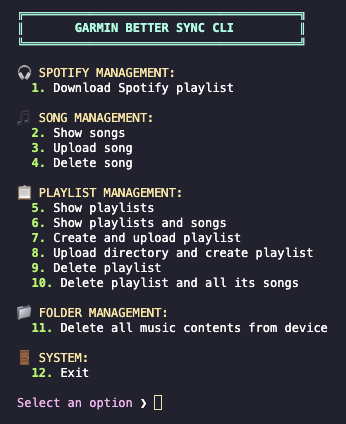

# ⌚ Better Sync

_The missing alternative to Garmin Express_

A command-line tool that uses MTP (Media Transport Protocol) to manually manage Spotify playlists and music on your Garmin device. This is a replacement option to Garmin Express.

Note: I'm currently working on a desktop GUI for this tool.



## Installation

## Requirements

- `libusb` - Required for device communication

  ```bash
  brew install libusb
  ```

- `ffmpeg` - Required for audio processing

  ```bash
  brew install ffmpeg
  ```

- `pip` - Required for using third-party Python libs (Spotify downloader)

```
virtualenv venv
source venv/bin/activate
pip install spotdl
```

### From Source

1. Make sure you have Go 1.19 or newer installed
2. Clone the repository
3. Build the project:

```bash
git clone https://github.com/schachte/better-sync.git
cd better-sync
make build && ./build/better-sync
```

## Usage

### Basic Usage

```bash
# Run the CLI in development mode
make dev

# Build the CLI application
make build

# Run the UI application in development mode
make app-dev

# Build the UI application
make app-build
```

## Packaging

```shell script
brew install libusb

# get libusb path from brew
LIBUSB_PATH=$(brew --prefix libusb)
sudo install_name_tool -id "@executable_path/libusb.dylib" "$LIBUSB_PATH/lib/libusb-1.0.0.dylib"

# copy the dynamic library to the project
cp "$LIBUSB_PATH/lib/libusb-1.0.0.dylib" ./libusb.dylib

# confirm whether the libusb.dylib is portable
otool -L libusb.dylib

# the output should look: libusb.dylib: @executable_path/libusb.dylib
git add libusb.dylib
```

## Environment Variables

```
# Optional for various Spotify API calls
SPOTIFY_CLIENT_ID=<redacted>
SPOTIFY_CLIENT_SECRET=<redacted>
```
